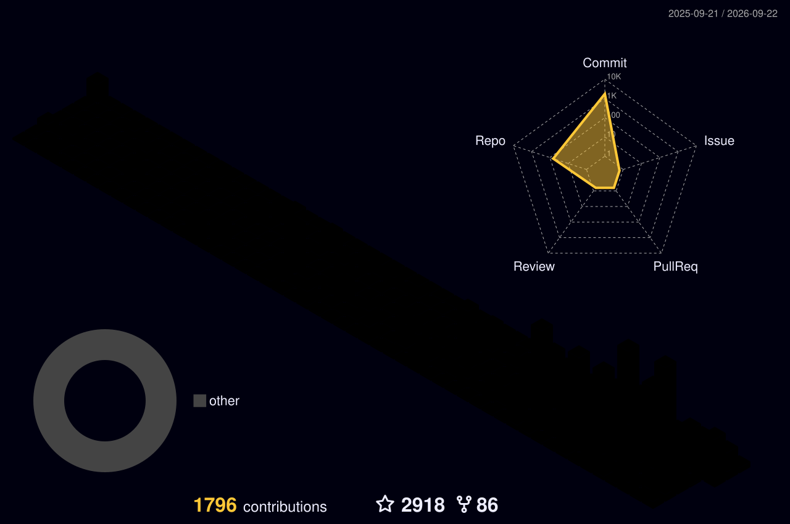

<!-- 动态标题 -->

<!--

-->
 

 

 

<picture>
  <source media="(prefers-color-scheme: dark)" srcset="./profile-snake-contrib/github-contribution-grid-snake-dark.svg" />
  <source media="(prefers-color-scheme: light)" srcset="./profile-snake-contrib/github-contribution-grid-snake.svg" />
  
</picture>

## 🚩 Hello

<table>
<tr>
<td width="100%">

### 🤖 About Me

- 🔧 喜欢折腾 **GitHub / Linux / VPS / 自动化 / 网络工具**
- 📚 持续维护开源资料、教程、测评与多语言 README
- ⚙️ 关注自动化监控、可观测性、CLI 工具与长期稳定运行
- 🧩 偏爱把重复工作做成脚本、Workflow 和可复用流程
- 🌱 **Keep building. Keep documenting. Keep improving.**

</td>
</tr>
</table>
<!-- 这里故意不再使用 github-readme-stats 的 pin 图片卡片。
直接使用 GitHub 原生 Markdown/HTML，可以避免第三方图片服务限流或挂掉后出现破图。

## 🚀 Featured Projects

<table>
<tr>
<td width="50%" valign="top">

### ⭐ [mojie](https://github.com/jdnei/mojie)

**魔戒机场官方地址**

多语言 README 与最新地址维护。

</td>
<td width="50%" valign="top">

### ⭐ [JiChangTuiJian](https://github.com/jdnei/JiChangTuiJian)

**2026 最新好用的机场推荐与节点分享**

持续更新的机场推荐、评测与节点资料。

</td>
</tr>

<tr>
<td width="50%" valign="top">

### ⭐ [liangxin](https://github.com/jdnei/liangxin)

**LiangXin 良心云机场官方地址**

官方地址与相关资料维护。

</td>
<td width="50%" valign="top">

### ⭐ [naiyun](https://github.com/jdnei/naiyun)

**奈云机场官方地址**

奈云最新地址与相关资料维护。

</td>
</tr>
</table>
-->

---

## 📊 GitHub Overview

<!-- 本地由 GitHub Actions 生成；不依赖 github-readme-stats / vercel 实时服务 -->

---

## 🌌 3D Contributions

<picture>
  <source media="(prefers-color-scheme: dark)" srcset="./profile-3d-contrib/profile-night-rainbow.svg" />
  <source media="(prefers-color-scheme: light)" srcset="./profile-3d-contrib/profile-season-animate.svg" />
  
</picture>

---

## 👥 Followers

<!-- 本地由 lowlighter/metrics 生成：真实 followers 数量 + 圆形头像墙 -->

---

## 🗓️ Full-Year Contributions

---

**Thanks for visiting 👋**

